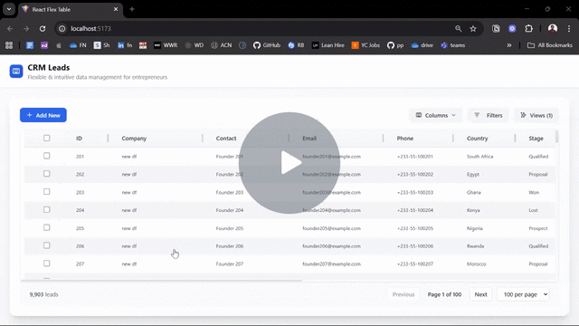

# React Flex Table

A modern, flexible, and performant data table built with **React**, **Vite**, **TailwindCSS**, and **TanStack Table**.  
It supports large datasets, inline editing, saved views, filter builder, bulk actions, and a lightweight **Express + SQLite** backend.

---

## Table of Contents
- [Features](#-features)
- [Project Structure](#-project-structure)
- [Getting Started](#-getting-started)
- [Design & Architecture](#-design--architecture)
- [Known Limitations & Trade-offs](#-known-limitations--trade-offs)
- [Future Improvements](#future-improvements)

---

## 🚀 Features
- **Dynamic tables** – Resize, reorder, hide, and show columns to fit your workflow without losing track of data.  
- **Large dataset handling** – Virtual scrolling keeps the interface smooth and responsive, even with thousands of records.  
- **Inline editing** – Update records directly in the table. Inputs adapt to the data type (text, notes, numbers, dates, dropdowns), so editing feels natural.  
- **Saved views** – Store table setups (filters, sorting, visible columns, pagination) and switch between them as needed. Great for recurring workflows.  
- **Advanced filters** – Build flexible conditions with AND/OR logic, allowing both quick searches and complex queries.  
- **Bulk actions** – Edit, duplicate, or delete multiple records at once, with clear confirmation and feedback.  
- **User feedback** – Newly added rows are highlighted for context, and toast notifications confirm actions like saves, edits, or deletes.  
- **Accessible & responsive UI** – Keyboard shortcuts (Enter, Escape) for editing, sticky headers, hover/focus indicators, and a layout that works across screen sizes.


## 🎥 Demo
[](https://www.loom.com/share/50a0de6b8ee14bf6ad44aa9539990bab)


## 📂 Project Structure

```
react-flex-table/
├── public/               # Static assets
├── server/               # Backend API + SQLite DB
│ ├── db.js               # Database setup & helpers
│ ├── package.json        # Backend dependencies
│ └── server.js           # Express server
├── src/                  # Frontend React app
│ ├── assets/             # Images, styles, icons
│ ├── components/         # UI components
│ │ ├── DataTable.jsx
│ │ ├── Toolbar.jsx
│ │ ├── Filters.jsx
│ │ ├── SavedViews.jsx
│ │ └── ...
│ ├── hooks/              # Custom React hooks
│ ├── lib/                # Data fetching helpers
│ ├── App.jsx             # Root React app
│ └── main.jsx            # Entry point
├── package.json          # Frontend dependencies
└── README.md             # Project documentation
```

---

## ▶️ Getting Started

### Prerequisites
- Node.js **18+**

### Install
```bash
# Frontend
npm install

# Backend
cd server
npm install
```

### Run
```bash
# Backend
cd server
npm run dev      # http://localhost:5174

# Frontend (in another terminal)
cd ../
npm run dev      # http://localhost:5173
```

> The SQLite database files (`flex-table.db`, `-wal`, `-shm`) live in `/server`.

---

## 🧩 Design & Architecture

### Frontend

- **Composable table core**. Built from small, predictable pieces (columns, rows, cells, header, toolbar) so it’s easy to extend with behaviors like resizing, reordering, and visibility toggles.
- **Scales to large datasets**. Uses virtualization to render only what’s visible, keeping the DOM light and interactions smooth even with tens of thousands of records.
- **Inline, context-aware editing**. Cells adapt to their data type (text, notes, select lists, numbers, dates). Text inputs auto-grow; updates are saved with debouncing or immediately where appropriate, with rollbacks on error.
- **Portable "views"**. Users can save and recall table configurations—filters, sorting, visible columns, and page size. The UI highlights when the current setup differs from a saved view.
- **Flexible filtering**. Quick per-column search and an advanced filter builder (with AND/OR logic) for more complex queries.
- **Intuitive UX details**. Sticky headers, clear hover/focus states, keyboard shortcuts (Enter/Escape), toast notifications for bulk actions, and row highlighting after creation help users stay oriented and confident.

### Backend
- A lightweight **Express + SQLite** API powers persistence.  
- Provides CRUD endpoints for leads and saved views.  
- Ships with mock data for leads, so the app is usable right away.  
- Enables persistence of saved views so they survive page reloads, instead of living only in memory.  
---

## ⚠️ Known Limitations & Trade-offs

- The backend is minimal — designed for demo purposes, not production use. 
- No authentication — all users share the same dataset and views in this demo setup. 
- Filtering and sorting logic is simple; complex scenarios (e.g. nested conditions, fuzzy text search) would need more robust handling.   
- Only light client validation checks; minimal server validation.
- SQLite makes it easy to run locally, but isn’t a scalable solution for multi-user deployments. 
- Mobile-responsiveness limited for some features

---

## 🛠️ Future Improvements
- Role-based auth; per-user/team view sharing
- Support for exporting data (CSV, Excel, PDF). 
- Column-level validation and error feedback.  
- Replace SQLite with Postgres/MySQL for multi-user scaling.
- Audit log for edits; undo/redo

---

